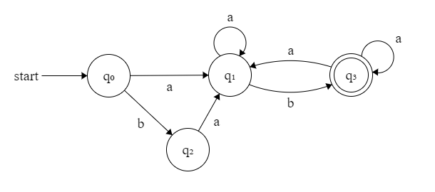
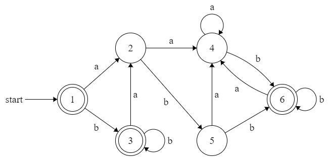
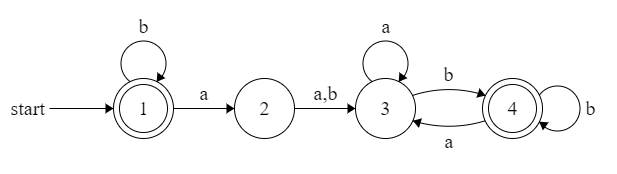

# 上下文无关文法

## 设计上下文无关文法

1. {a^n^b^n^c^m^d^m^|n≥1,m≥1}∩{a^n^b^m^c^m^d^n^|n≥1,m≥1}

   S->AB|T
   T->aTd|aCd
   A->aAb|ab
   B->cBd|cd
   C->bCc|bc

2. {a^n^b^m^|n,m≥0∧n≥m}

   S->A|B
   A->aA|aC
   B->Bb|Cb
   C->aCb|ε

3. {a^n^b^m^|n≥0,m≥0,3n≥m≥2n}

   S->aSbb|aSbbb|ε

4. {w|w∈{a,b}^\*^,w中a和b的数目不同}

   S->A|B
   A->AA|Ta
   B->BB|Tb
   T->aTbT|bTaT|ε
   注意此处T生成a与b数目相同的字符串

5. {w|w∈{a,b}^\*^,且w中a与b的数目相差为2}

   S->TaTaT|TbTbT
   T->aTbT|bTaT|ε

## 文法和语言中的二义性

*文法无二义性：语法分析树唯一，亦等价于最左推导唯一*

1. 下面的文法生成的是具有x和y的操作数、二元运算符+、-和*的前缀表达式：

   E->+EE|*EE|-EE|x|y

   证明这个文法是无歧义的。（Hopcroft, 5.4.7(b)）

   提纲：可证明其最左推导是唯一的，对字符串长度归纳，同时归纳证明生成的字符串w所有非空后缀字符串中操作数个数多于运算符个数。

# 正则语言

## 设计正则语言

1. {xwx^R^|x,w∈(a+b)+},其中(a+b)^+^=(a+b)(a+b)^\*^,x^R^为x的反向(即反转)

   a(a+b)(a+b)^\*^a+b(a+b)(a+b)^\*^(a+b)

2. {w|w∈{a,b}^\*^∧∃x,y(x,y∈{a,b}^\*^∧w=xy∧|y|=3∧y=y^R^)}

   (a+b)^\*^(aaa+aba+bab+bbb)

3. {w∈{a,b}^\*^|w中既不包含子串aa,也不包含子串bb}

   (ε+b)(ab)^\*^(ε+a)

4. {a^n^b^m^|n,m≥0且n+m为偶数}

   (aa)^\*^(bb)^\*^+(aa)^\*^a(bb)^\*^b

5. {w|w∈{a,b}^\*^,|w|≥1,且w的后20位至少有一个a}

   (a+b)^\*^a(a+b+ε)^19^

6. {w|w∈{a,b}^\*^,|w|≥1,且当w以a结尾时,它的长度为奇数}

   ((a+b)(a+b))^\*^a+(a+b)^\*^b

7. {w|w∈{a,b}^\*^,|w|≥2,且w的前5位至少有一个子串aa}

   (a+b+ε)^3^aa(a+b)^\*^

8. {w|w∈{a,b}^\*^,|w|≥2,且w的第2位至第5位至少有一个a}

   (a+b)(a+b+ε)^3^a(a+b)^\*^

9. {w|w∈{0,1}^\*^,w至少含有3个1,且倒数第3位为1}

   (0+1)^\*^1(0+1)^\*^1(0+1)^\*^100+(0+1)^\*^1(0+1)^\*^1(01+10)+(0+1)^\*^111

# 有限自动机

安利一个用来画自动机的app：<http://madebyevan.com/fsm/>

## 设计DFA

1. 长度至少为2且头两个字符不相同的0,1串构成的集合

|      | 0    | 1    |
| ---- | ---- | ---- |
| ->q0 | q1   | q2   |
| q1   | q4   | q3   |
| q2   | q3   | q4   |
| *q3  | q3   | q3   |
| q4   | q4   | q4   |

2. {w∈{a,b}^\*^|w中不包含子串aa}

|       | a    | b    |
| ----- | ---- | ---- |
| ->*q0 | q1   | q0   |
| *q1   | q2   | q0   |
| q2    | q2   | q2   |

3. {w∈{a,b}^\*^|w中包含且仅包含奇数个子串ab}

|      | a    | b    |
| ---- | ---- | ---- |
| ->q0 | q1   | q0   |
| q1   | q1   | q2   |
| *q2  | q3   | q2   |
| q3   | q3   | q0   |

4. {w∈{a,b}^\*^|w中a的个数和b的个数之和是奇数}

|      | a    | b    |
| ---- | ---- | ---- |
| ->q0 | q1   | q1   |
| *q1  | q0   | q0   |

5. {w∈{a,b}^\*^|w含相同个数的a和b,且w的每个前缀中a和b个数之差不超过1}

|       | a    | b    |
| ----- | ---- | ---- |
| ->*q0 | q1   | q2   |
| q1    | q3   | q0   |
| q2    | q0   | q3   |
| q3    | q3   | q3   |

6. {w∈{a,b}^\*^|w包含子串ab，但不包含子串bb}

  

相应的NFA有：

  

此NFA遇到子串ab时到达终态，如果是最后一个ab，则停留在终态，反之跳转回q1。

## DFA的最小化

构造与该DFA等价的最小化的DFA：

填表算法第一步区分1，3，6与2，4，5

第二步区分2与4，5（输入字符b）

第三步区分1，3与6（输入字符a）

故最终等价类有{1, 3}, {2}, {4, 5}, {6}

最小化的DFA是

